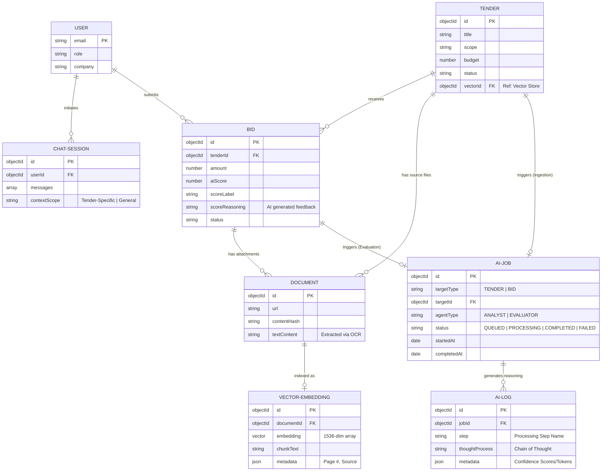

# Advanced AI Entity Relationship Diagram (ERD)

This document outlines the proposed target architecture for the JAAVIS platform, incorporating advanced AI workflows, vector search capabilities, and transparent reasoning logs.

## Target Architecture Model

---

## Architectural Highlights

### 1. AI Processing Pipeline (`AI-JOB` & `AI-LOG`)
- **Asynchronous Execution**: Tender ingestion and Bid evaluation are handled as background jobs to ensure UI responsiveness.
- **Transparency**: The `AI-LOG` entity captures the "Chain of Thought," allowing users to see exactly how the AI arrived at a specific score or suggestion.

### 2. Vector Search Infrastructure (`VECTOR-EMBEDDING`)
- **RAG Capability**: Documents are chunked and embedded into a high-dimensional vector space (e.g., Pinecone or pgvector).
- **Semantice Search**: The `vectorId` in the `TENDER` model enables fast, context-aware retrieval of relevant construction codes and requirements.

### 3. Integrated Feedback Loop
- **Evaluation Reasoning**: Use `scoreReasoning` in the `BID` model to provide actionable feedback to subcontractors based on the matching results from the Evaluator agents.
